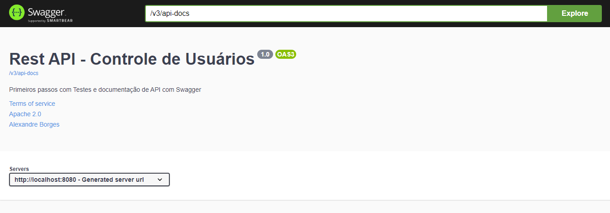
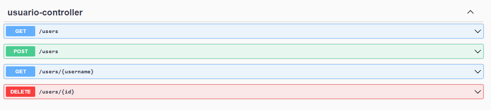

# API Java, Spring Boot e Swagger.

> Projeto api desenvolvido com Java e Spring Boot e documentada com  Swagger.

Esse repositório armazena um projeto de API desenvolvido utilizando as linguagens Java e o framework Spring
Boot.

Foi utilizado o framework Swagger para documentar e testar a APi.

Aplicação documentada com Swagger:

Rotas da API:

> URL de vizualização da aplicação via Swagger.
>
>> http://localhost:8080/swagger-ui/index.htm

## Tecnologias
- Java
- Spring boot
- Swagger
- Git e GitHub

